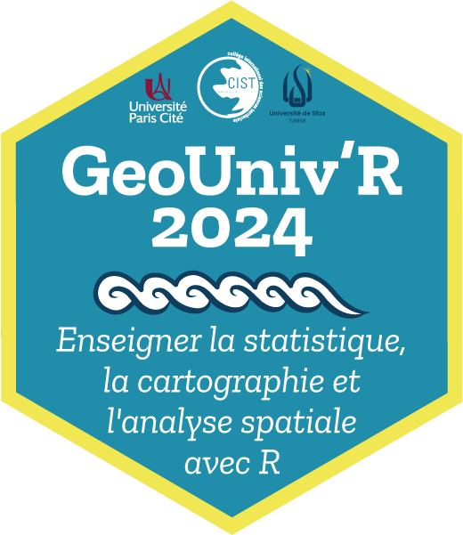

# GEO UNIV'R Tunisie 2024

## <ins>Liste des cours et supports</ins>

### [LUN1] Introduction à la programmation, R et les Notebooks 

Introduction de l'école thématique

- <a href = "https://geounivr.github.io/LUN1_intro/#/title-slide" target = "_BLANK">LUN_1_intro</a>

### [LUN3] Acquisition de données géographiques et visualisations de base 

Comment importer, explorer, manipuler, visualiser (simplement) et exporter des données géographiques avec R

- <a href = "https://geounivr.github.io/LUN3_Manipulation_donnees/" target = "_BLANK">LUN_3_manipulation de données</a>

### [MAR1] Manipuler les vecteurs avec R et le package sf 

Comment réaliser des traitements SIG (géotraitements, selections attributaires et spatiales, jointures etc...) avec R

- <a href = "https://geounivr.github.io/MAR1_vecteur/" target = "_BLANK">MAR_1_vecteurs</a>

### [MAR2] Cartographie avec R

Présentation d'introduction à la cartographie thématique. Son histoire. Ses regles. Etc.

- <a href = "https://neocarto.github.io/geounivr2024/MAR_2_carto_intro/docs/index.html" target = "_BLANK">MAR_2_carto_intro</a>

Cartographie thématique avec R.

- <a href = "https://neocarto.github.io/geounivr2024/MAR_2_carto/index.html" target = "_BLANK">MAR_2_carto</a>

- <a href = "https://github.com/neocarto/geounivr2024/raw/main/carto.zip" target = "_BLANK">Notebook quarto pour démarrer</a>

### [VEN1] Géovisualisation

Cours d'introduction. Cartographier pour le Web avec quarto.

- <a href = "https://neocarto.github.io/geounivr2024/VEN1_geoviz_intro/docs/index.html" target = "_BLANK">VEN1_geoviz_intro</a>

Travaux pratiques. Cartographier pour le Web avec quarto {ojs} et la bibliothèque JavaScrip geoviz

- <a href = "https://neocarto.github.io/geounivr2024/VEN1_geoviz_TP/docs/index.html" target = "_BLANK">VEN1_geoviz_TP</a>

Un exemple de dashboard avec Quarto

- <a href = "https://neocarto.github.io/geounivr2024/VEN1_geoviz_dashboard/index.html" target = "_BLANK">VEN1_geoviz_dashboard</a>

